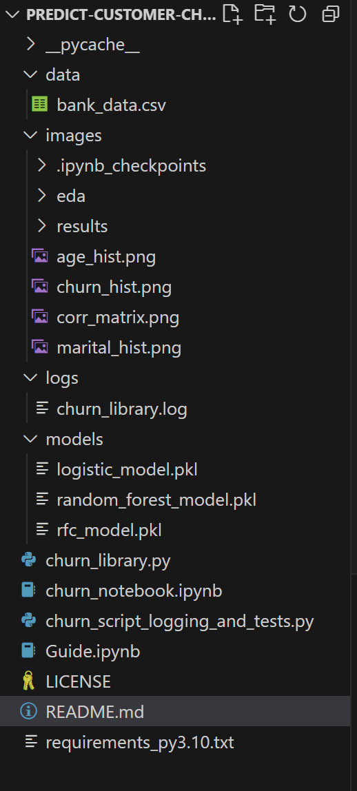

# Predict Customer Churn

- Project **Predict Customer Churn** of ML DevOps Engineer Nanodegree Udacity

## Project Description
The project attempts to productionize the jupyter notebook (`churn_notebook.ipynb`) that implements the model that identifies credit card customers who are most likely to churn. The project implements software engineering best practices in developing  a modular, documented, and tested python scripts that follow PEP8 coding practices. 

## Files and data description
Overview of the files and data present in the root directory. 
1. `data` Folder
    This folder contains the CSV file.
2. `images` Folder
    This folder is a repository of the outputs from the EDA process.
3. `logs` Folder
    This folder is a repository of the output from the testing script.
4. `models` Folder
    This folder is a repository for the models output from the training process.

    

## Running Files
1. Create a virtual enviroment for python 3.10
    `conda create --name churn_env python=3.10`
2. Activate the environment and install the packages in `requirements_py3.10.txt`
    `conda activate churn_env`
    `conda install --file requirements_py3.10.txt`
3. Run the scripts 
    `python churn_library.py`
    `python churn_script_logging_and_tests.py`

